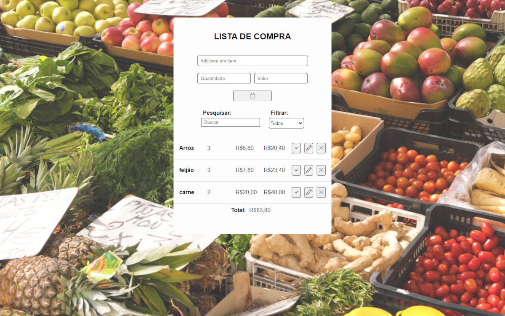

# Lista de Compras

Este é um simples aplicativo web para gerenciar sua lista de compras. Você pode adicionar, editar, marcar como concluído e excluir itens da sua lista. Além disso, há recursos como filtro por status e pesquisa para facilitar a visualização.

## Como Usar

1. Clone este repositório.
2. Abra o arquivo `index.html` em um navegador da web ou acesse a [página do GitHub Pages](https://mattheus910.github.io/lista-de-compra/).
3. Comece a gerenciar sua lista de compras!

## Funcionalidades

- Adicionar itens à lista.
- Editar informações dos itens.
- Marcar itens como concluídos.
- Excluir itens da lista.
- Filtrar por status (todos, concluídos, outros).
- Pesquisar itens na lista.

## Tecnologias Utilizadas

- HTML5
- CSS3
- JavaScript

## Local Storage

Os itens da lista são armazenados localmente no seu navegador, permitindo que você mantenha sua lista mesmo ao fechar e reabrir a página.

## Imagem do Aplicativo

> [Veja o aplicativo em ação](https://mattheus910.github.io/lista-de-compra/)

